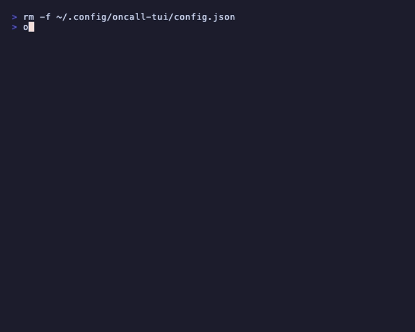
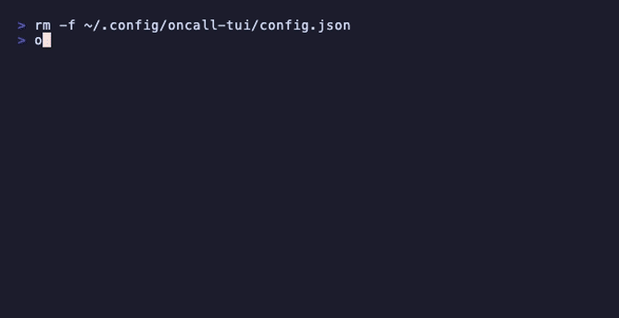
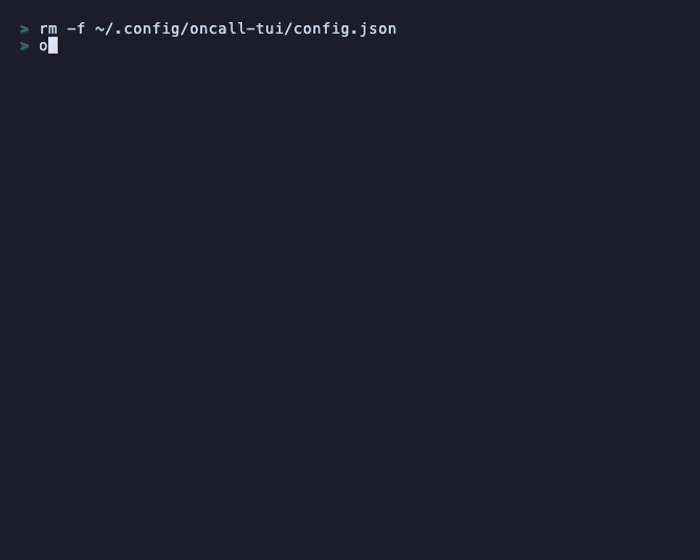

# oncall-tui

A terminal UI tool for logging on-call incidents. Fill in a short form, and the tool pipes your notes to the local Claude Code CLI to produce a well-structured markdown incident report — saved to a folder of your choice.



---

## Features

- Interactive multi-step TUI powered by [Bubble Tea](https://github.com/charmbracelet/bubbletea)
- First-run setup prompt to configure where incidents are saved
- Prompts for PagerDuty incident number, summary, start/end times, tags, and resolution
- Summary and resolution fields support **multiline input** (`Enter` = newline, `Ctrl+D` = done)
- Start time defaults to now — press `→` to accept and edit
- Leaving end time blank marks the incident as **still open**; press `→` to fill current time
- Enriches notes via the local `claude` CLI using a consistent report template (no API key needed)
- Confirm screen shows all fields including save location before submitting
- Back-navigation between fields with `Tab` / `Shift+Tab`
- `--resolution` flag to append a resolution to an existing incident
- `--close` flag to close an open incident — sets end time and optional resolution

---

## Requirements

- Go 1.21+
- [Claude Code](https://claude.ai/code) CLI installed and authenticated (`claude` must be on your `PATH`)

---

## Installation

```bash
git clone https://github.com/lpinto23/oncall-tui.git
cd oncall-tui
make install          # builds and copies binary to /usr/local/bin
```

To upgrade after pulling new changes:

```bash
make upgrade          # git pull + rebuild + reinstall
```

To uninstall:

```bash
make uninstall
```

---

## Usage

### Log a new incident

```bash
oncall-tui
```

### Add a resolution to an existing incident

```bash
oncall-tui --resolution PD-12345
```

Opens a single-field form for the resolution text. The file is looked up by incident ID — if found, the resolution is appended; if not found, you are offered the option to create a new entry with the ID pre-filled.

### Close an open incident

```bash
oncall-tui --close PD-12345
```

Prompts for an end time (defaults to now) and an optional resolution. Updates `**End:** Still open` in the existing file and appends a `## Resolution` section if provided. If no file is found, you are offered to create a new entry.

---

## First run

On the first run you will be prompted to choose where incident files are saved. The default (`~/oncall-incidents`) is shown as a placeholder — press `→` to accept it or type a custom path, then `Enter` to confirm. The choice is saved to `~/.config/oncall-tui/config.json` and never asked again.



---

## Incident form



The tool walks you through six fields:

| Step | Field | Required | Notes |
|------|-------|----------|-------|
| 1 | PagerDuty incident number | Yes | |
| 2 | Summary | Yes | Multiline — `Enter` = newline, `Ctrl+D` = next |
| 3 | Start time (`YYYY-MM-DD HH:MM`) | No | Blank = now |
| 4 | End time (`YYYY-MM-DD HH:MM`) | No | Blank = still open |
| 5 | Tags (comma-separated) | No | |
| 6 | Resolution | No | Multiline — `Enter` = newline, `Ctrl+D` = next |

After confirming, the tool calls Claude and writes the enriched report to your configured directory.

---

## Time field behaviour

| Scenario | Result |
|----------|--------|
| Start time left blank | Defaults to the current time |
| Start time `→` pressed | Fills current time for editing |
| End time left blank | Logged as **Still open** |
| End time `→` pressed | Fills current time for editing |
| Either time typed manually | Parsed as `YYYY-MM-DD HH:MM` |

---

## Keyboard shortcuts

| Key | Action |
|-----|--------|
| `Enter` | Advance to next step / insert newline in multiline fields |
| `Ctrl+D` | Finish a multiline field and advance |
| `→` | Accept the placeholder value for the current field |
| `Tab` / `↓` | Move to next field |
| `Shift+Tab` / `↑` | Move to previous field |
| `Esc` / `Ctrl+C` | Quit |

---

## Output format

Files are saved as:

```
INCIDENT_{PAGERDUTY_ID}_{YYYY-MM-DD-HH-MM-SS}.md
```

### Resolved incident

```markdown
# Incident PD-12345

**Logged:** 2026-06-01 14:30:00 UTC

**Start:** 2026-06-01 13:00:00 UTC
**End:** 2026-06-01 14:15:00 UTC
**Tags:** database, p1, latency

---

Database latency spike caused elevated error rates on the checkout service.

## Description

On 2026-06-01 between 13:00 and 14:15 UTC, elevated database query latencies caused increased
error rates on the checkout service. The issue was tagged as database, p1, and latency.

## Incident Details

| Field       | Value                    |
| ----------- | ------------------------ |
| Incident ID | PD-12345                 |
| Start Time  | 2026-06-01 13:00:00 UTC  |
| End Time    | 2026-06-01 14:15:00 UTC  |
| Duration    | ~75 minutes              |
| Tags        | database, p1, latency    |

## Impact

Users experienced failures or degraded performance during checkout for approximately 75 minutes.

## Timeline

| Time (UTC) | Event                                          |
| ---------- | ---------------------------------------------- |
| 13:00      | Incident begins — database latency spike       |
| 14:15      | Incident resolved                              |

## Resolution

The primary database replica was promoted after the primary node became unresponsive.
Query latencies returned to normal within two minutes of the failover.
```

### Still-open incident (end time left blank)

```markdown
# Incident PD-12345

**Logged:** 2026-06-01 14:30:00 UTC

**Start:** 2026-06-01 13:00:00 UTC
**End:** Still open
**Tags:** database, p1, latency

---

Database latency spike caused elevated error rates on the checkout service.

## Description

...

## Timeline

| Time (UTC) | Event                                    |
| ---------- | ---------------------------------------- |
| 13:00      | Incident begins — database latency spike |
| TBD        | Incident resolved                        |
```

### After running `--close`

The `**End:** Still open` line is patched in-place and a `## Resolution` section is appended:

```markdown
**End:** 2026-06-01 14:15:00 UTC

...

## Resolution

**Resolved:** 2026-06-01 14:15:00 UTC

The primary database replica was promoted after the primary node became unresponsive.
```

---

## Configuration

The config file lives at:

```
~/.config/oncall-tui/config.json
```

It is created automatically on first run via the setup prompt. To change the output directory afterwards, edit the file directly:

```json
{
  "output_dir": "/path/to/your/incidents"
}
```

---

## How enrichment works

After you confirm the form, the tool pipes the raw incident notes as stdin to the local `claude` CLI:

```bash
echo "<prompt>" | claude -p --output-format text
```

Claude fills in a fixed template — intro paragraph, `## Description`, `## Incident Details` table, `## Impact`, `## Timeline`, and optionally `## Resolution` — so the output format is consistent across all incidents. No API key needed; it uses whatever Claude Code session is already authenticated on your machine.

---

## Development

```bash
make build    # build binary locally
make fmt      # format source
make vet      # run go vet
make clean    # remove built binary
```
